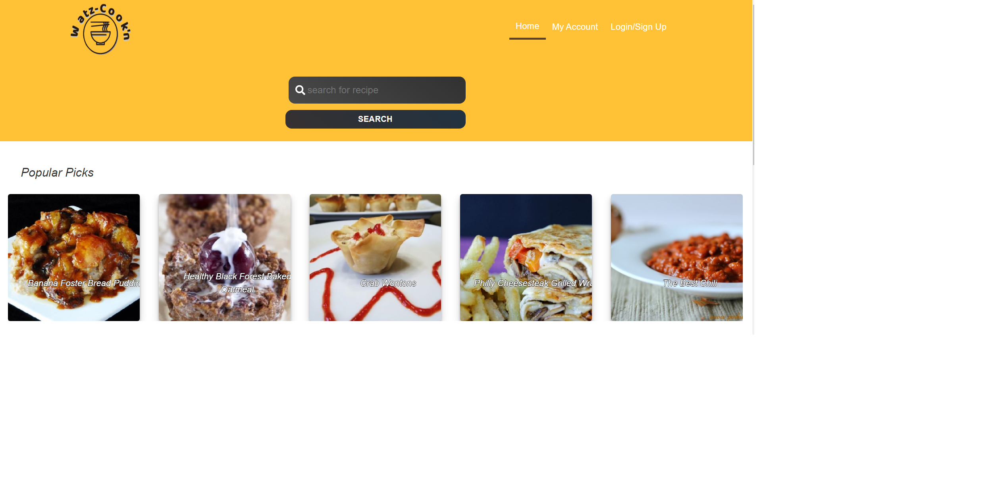
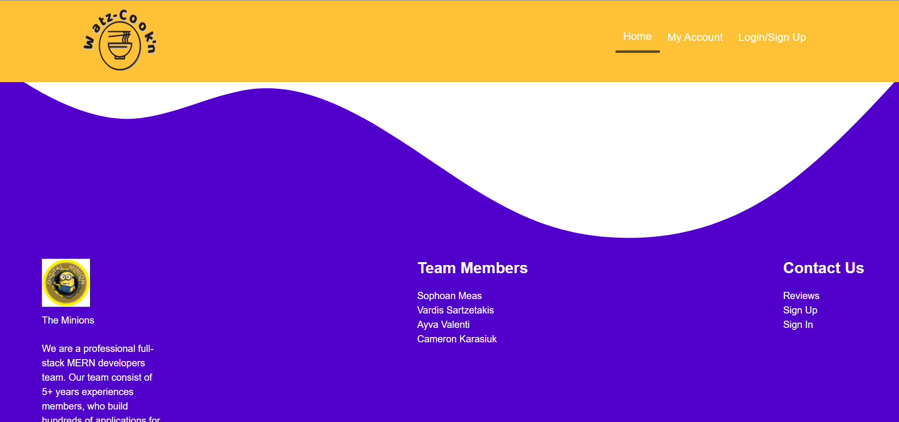
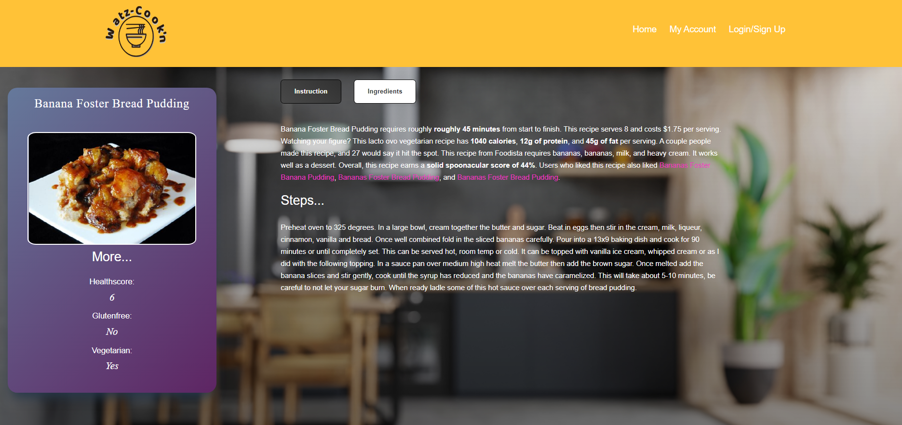
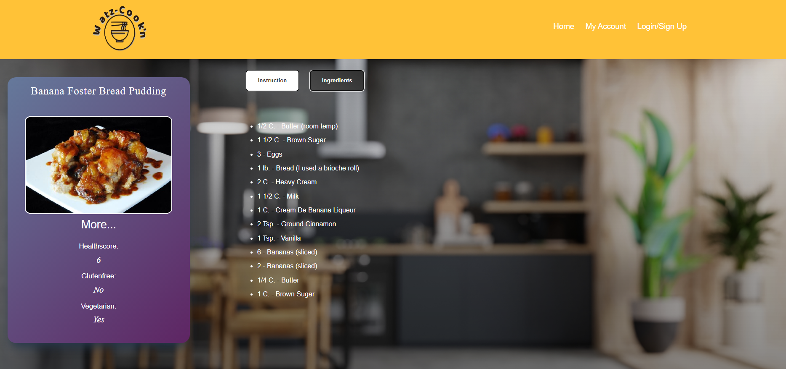
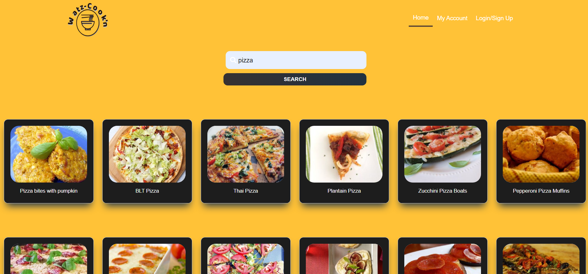

<h1 align="center">Book Search Engine </h1>

---

# Description

Watz-Cookin-N is an application where users are able to find a large variety based on different factors. Follow along as we develop this tasty app.

# Table of Contents

[Installation](#installation)

[Usage](#usage)

[Technologies](#technologies)

[Contribution](#contribution)

[Tests](#test)

[Questions](#questions)

[License](#license)

# Installation

1. First have Node.js installed
2. clone the repo and in your terminal type `git clone git@github.com:SophoanMeas/watz-cookin.git`
3. type `npm install` to install all the node dependencies for this project
4. type `npm run dev` to launch the application locally

# Usage
### Application

* <a href="https://watz-cookin-project3.herokuapp.com/" target="_blank"><h4> *Watz Cookin*</a>

# Technologies

Server Side
* apollo server
* express.js
* graphql - database storage
* mongoose
* bcrypt

Client Side

* apollo client
* graphql
* react-dom
* react-router-dom

Style
* bootstrap
* matrial-ui

# Contribution

* Fork the repo on GitHub
* Clone the project to your own machine
* Commit changes to your own branch
* Push your work back up to your fork
* Submit a Pull request so that we can review your changes

# Test

N/A
# Questions

---

<h1 align="center">Contact Me</h1>

Check out my Github for more projects

Have a question? Feel free to drop me an email.

📧[sophoan.meas@hotmail.com](mailto:sophoan.meas@hotmail.com)

---
# License

#### Copyright© [sophoanMeas](https://github.com/sophoanMeas). All rights reserved.
#### Licensed under *GNU*

---
## Screenshot

